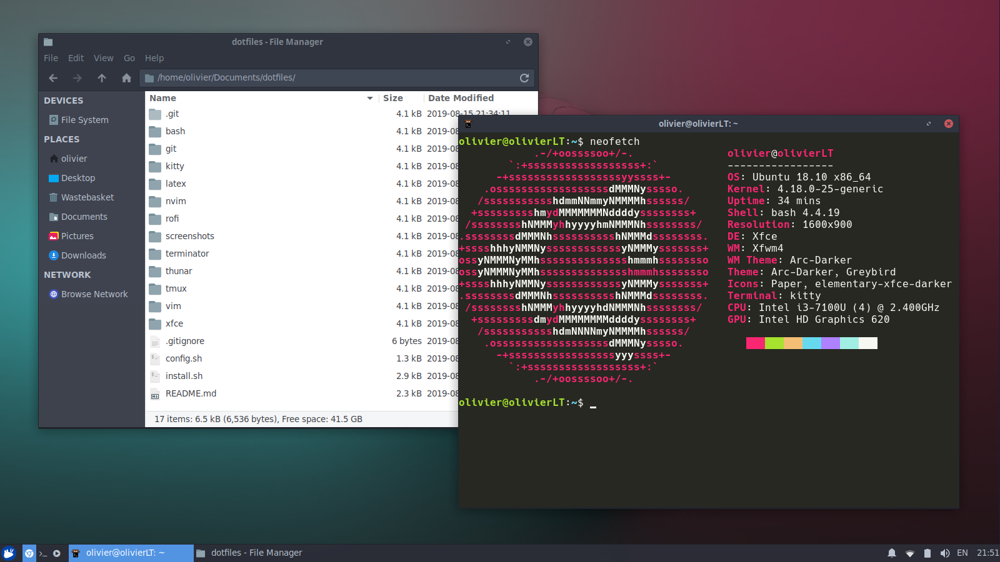
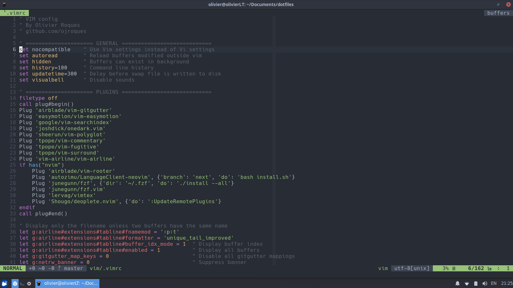

# dotfiles

This repository contains my configuration files for:
- **git**
- **bash**
- **tmux**
- **vim**, **neovim**, **vimium**
- [**kitty**](https://github.com/kovidgoyal/kitty), **terminator**
- **rofi**
- **latex**
- **thunar**
- **zathura**
- **xfce** (keyboard layouts and shortcuts)

I use [Xubuntu](https://xubuntu.org/) but installation should work fine on any recent (18.04+) Ubuntu-based distribution.


## Screenshots
Wallpaper can be found [here](./screenshots/wallpaper.png)




## Installation
1. Run `install.sh` as root to install applications:
```sh
sudo ./install.sh
```
2. Run `config.sh` to copy configuration files to the right places:
```sh
./config.sh
```
3. (Optional) Run `latex.sh` to install LaTeX:
```sh
latex/latex_setup.sh
```
4. (Optional) Uncomment `alias vim=nvim` in `bash/.aliases` to use neovim instead of vim. Then run `lsp.sh` to install language servers for `LanguageClient-neovim` (a plugin to use the [Language Server Protocol](https://langserver.org)):
```sh
nvim/lsp.sh
```
5. Add email to `~/.gitconfig`. Run `vim` and execute `:PlugInstall` to install all plugins.


## After Installation
- Rearrange home directories
- Turn off unused services at startup
- Configure panel and workspaces
- Change theme and icons
- Install and configure additional applications: [fd](https://github.com/sharkdp/fd), [fzf](https://github.com/junegunn/fzf), [kitty](https://github.com/kovidgoyal/kitty), [ripgrep](https://github.com/BurntSushi/ripgrep), [spotify](https://www.spotify.com/uk/download/linux/)
- Change default applications
- Generate SSH keys: `ssh-keygen -t rsa -b 4096`
- Set wallpapers
