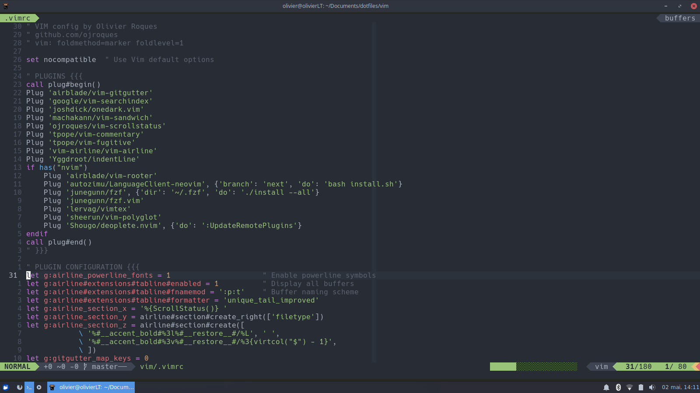

# dotfiles

This repository contains my config files for:
- **bash**
- **git**
- **kitty**
- **latex**
- **rofi**
- **neovim** and **vim**
- **windows terminal**
- **xfce** and **thunar**

I use [Xubuntu](https://xubuntu.org/) but installation should work fine on any
recent Ubuntu (20.04+) flavor.


## Screenshots


Wallpaper can be found [here](./screenshots/wallpaper.png)


## Installation
1. Run `install.sh` as root to install apps:
```sh
sudo ./install.sh
```
2. Run [stow](https://www.gnu.org/software/stow/) to install config files:
```sh
stow bash git kitty nvim rofi vim xfce
```
3. (Optional) Run `lsp.sh` to install
  [language servers](https://microsoft.github.io/language-server-protocol/):
```sh
./lsp.sh
```
4. (Optional) Run `latex/latex.sh` to install LaTeX:
```sh
./latex/latex_setup.sh
```


## After Installation
- Add email to [git config](git/.gitconfig)
- Run `nvim` and execute `:PaqInstall` to install plugins
- Install fzf: `~/.local/share/nvim/site/pack/paqs/start/fzf/install`
- Generate SSH keys: `ssh-keygen -t ed25519 -a 100 -C "email@example.com"`
